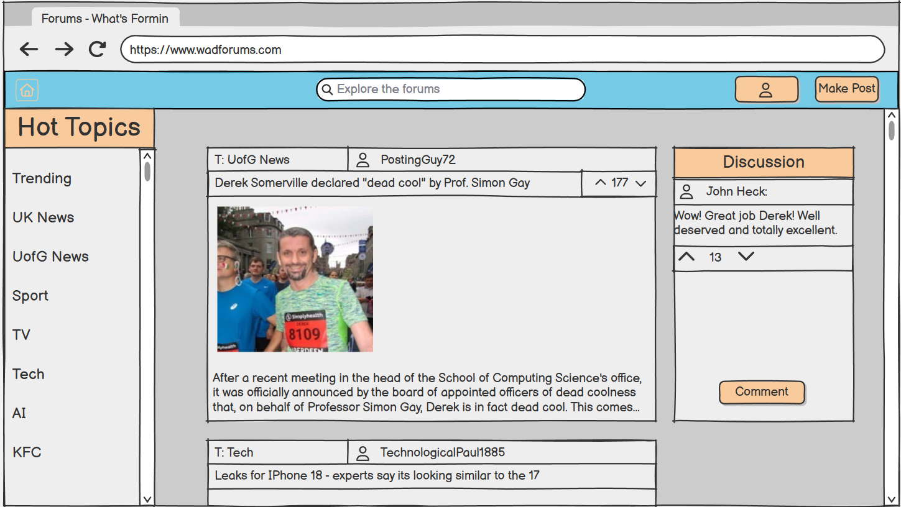
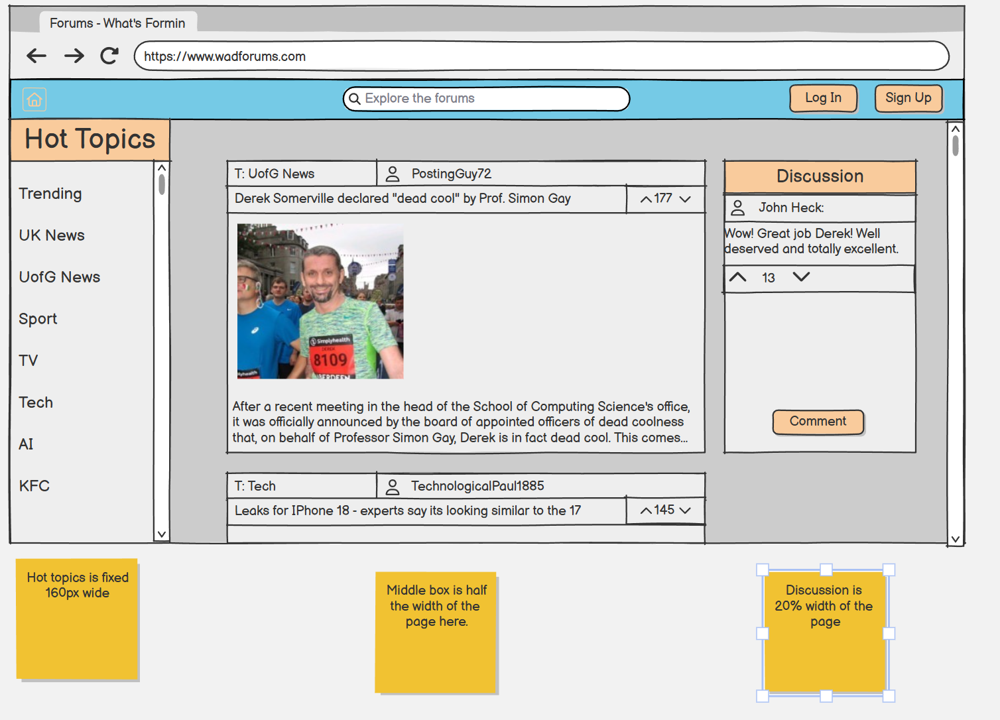
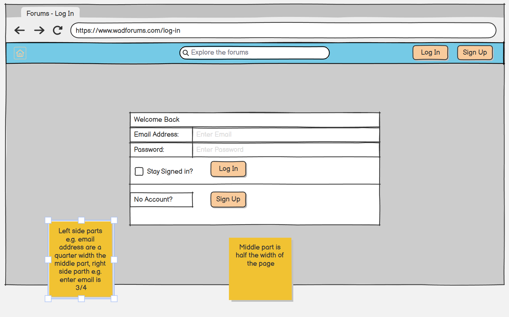
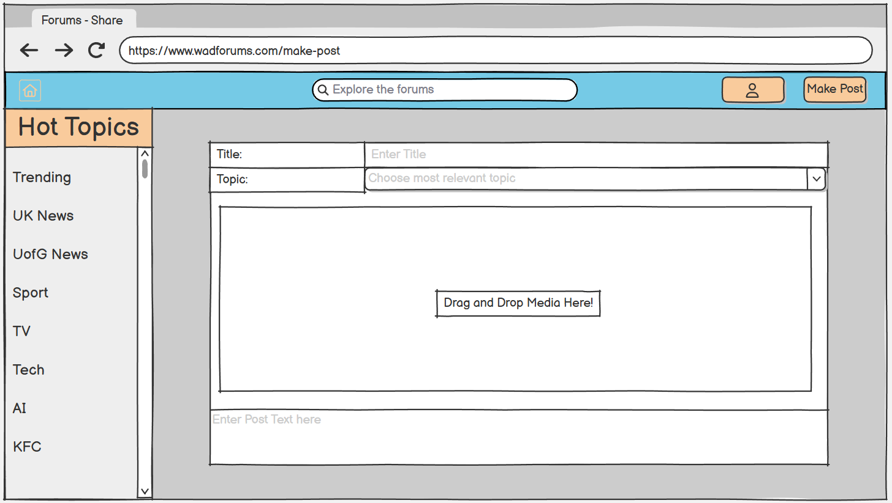
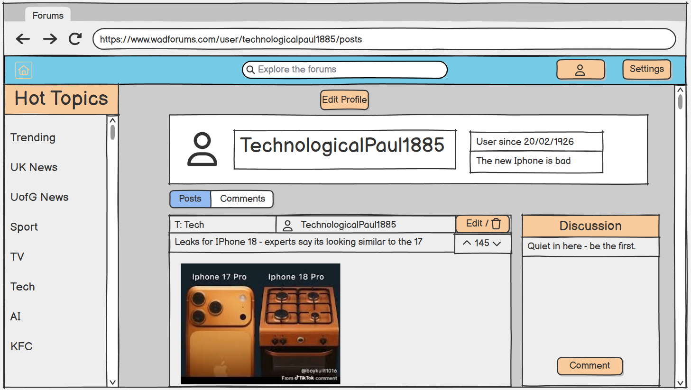
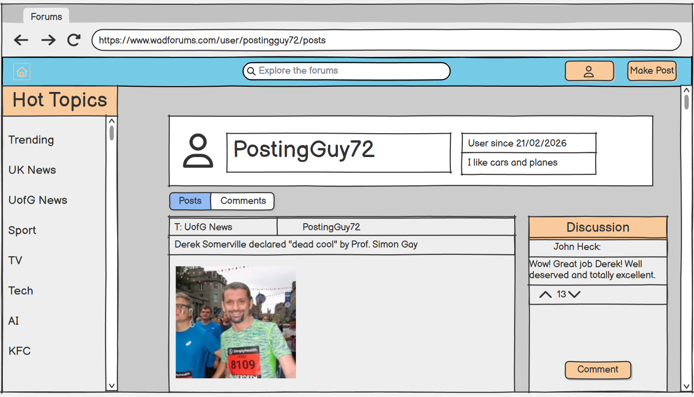
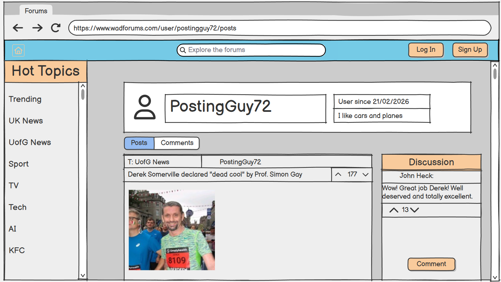

# Forums-WAD2-Team-8E 🚀

Welcome to the repository for our WAD2 Forums project! 

## 🎨 Design Specifications & Color Palette
To ensure a consistent UI across the frontend, we are strictly following this color scheme:
* **Standard Cyan Blue (Header Bar):** `#1ec9ff` (Note: This is applied with 50% opacity over the grey background in wireframes).
* **Standard Light Orange (Buttons, Hot Topics):** `#f9cb9c`.
* **Darker Grey (Site Background):** `#cccccc`.
* **Lighter Grey (Discussion and Posts boxes):** `#eeeeee`.
* **Error Red** `#ee0000`
* **Cream colour for hovering over buttons:** `#faf2e2`

---

## 🖼️ Project Wireframes

### 1. Home Page
* **Standard View:**

* **With Design Constraints (Notes):**

### 2. User Authentication

### 3. Creating Content

### 4. User Profiles
* **Viewing Own Profile (with Edit options):**

* **Viewing Other's Profile (Logged In):**

* **Viewing Other's Profile (Logged Out):**
